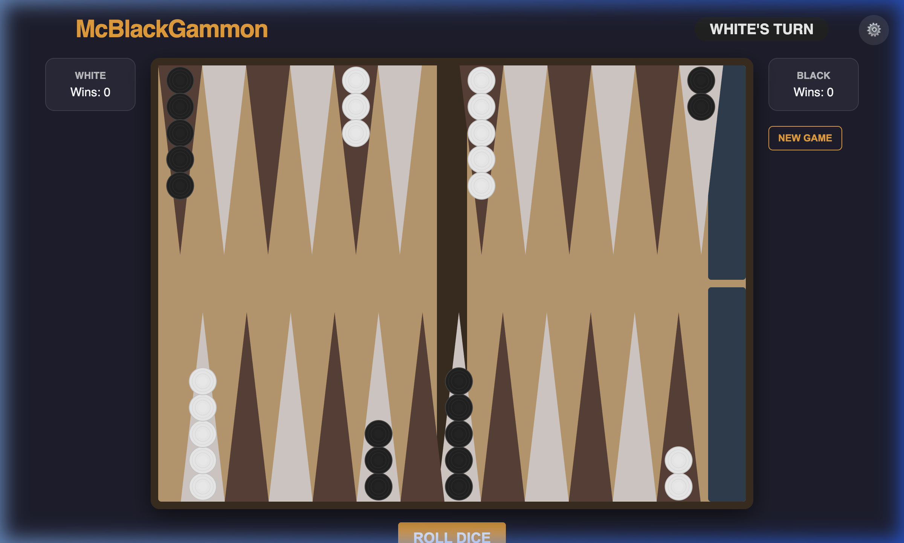

# McBlackGammon 🎲

A premium, web-based Backgammon experience built with React, TypeScript, and high-fidelity SVG graphics.



## ✨ Features

- **Premium SVG Board**: Scalable, high-contrast design optimized for all screen sizes.
- **Advanced AI**: Multiple difficulty levels (Easy, Medium, Hard) using a custom evaluation engine.
- **GSAP Animations**: Staggered movement and bouncing dice for a tactile feel.
- **Procedural Audio**: Zero-asset sound effects generated via Web Audio API.
- **Persistence**: Automatic save/resume and win tracking via `localStorage`.
- **Game Logic**: Full implementation of Backgammon rules, including hitting, bearing off, and bar re-entry.

## 🛠️ Tech Stack

- **Core**: React 19 + TypeScript
- **State Management**: Zustand (with Persist middleware)
- **Animations**: GSAP
- **Icons**: Lucide React
- **Testing**: Vitest
- **Build Tool**: Vite

## 🚀 Getting Started

### Prerequisites

- Node.js (v18 or higher)
- npm or yarn

### Installation

1. Clone the repository:
   ```bash
   git clone https://github.com/your-username/mcblackgammon.git
   cd mcblackgammon
   ```

2. Install dependencies:
   ```bash
   npm install
   ```

3. Start the development server:
   ```bash
   npm run dev
   ```

4. Build for production:
   ```bash
   npm run build
   ```

## 🧪 Testing

Run unit tests for the core game logic:
```bash
npm run test
```

## 📜 License

MIT License - feel free to use and modify!
